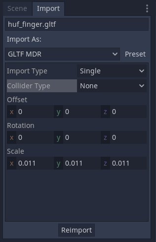
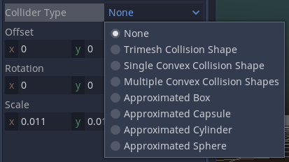

# Mesh data resource Module

A c++ Godot engine module, that adds a resource, which contains raw mesh data for merging and collider information.

The module also comes with importers (gltf, and collada for now), you can import 3d models as MeshDataResources with these.

## Optional Dependencies

`https://github.com/Relintai/props`: If present, you also get a prop importer for MeshDataInstances.

## Pre-built binaries

You can grab a pre-built editor binary from the [Broken Seals](https://github.com/Relintai/broken_seals/releases) 
repo, should you want to. It contains all my modules.

## MeshDataResource

The resource that holds mesh and collider data.

## MeshDataResourceCollection

Holds a list of MeshDataResources.

## MeshDataInstance

You can easily put MeshDataResources into the scene with these. They are equivalent to MeshInstances, except they work 
with MeshDataResources.

## Importers

In order to import a 3d model as a MeshDataResource, select the model, go to the import tab, and switch the import type to `<type> MDR`. Like:



If you set the import type to single, the importers will convert the first model that they encounter into a MeshDataResource, then save that,
if you set it to multiple, you get a MeshDataResourceCollection as the main resource, and also all encountered models as files separately.

Since MeshDataResource can hold collider information, these importers can create this for you. There are quite a few options for it:



## Building

1. Get the source code for the engine.

If you want Godot 3.2:
```git clone -b 3.2 https://github.com/godotengine/godot.git godot```

If you want Godot 4.0:
```git clone https://github.com/godotengine/godot.git godot```


2. Go into Godot's modules directory.

```
cd ./godot/modules/
```

3. Clone this repository

```
git clone https://github.com/Relintai/mesh_data_resource mesh_data_resource
```

4. Build Godot. [Tutorial](https://docs.godotengine.org/en/latest/development/compiling/index.html)


